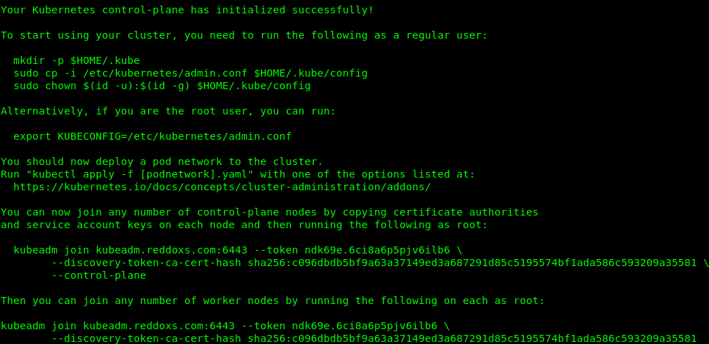

<header style="text-align:center;">
 
 
 
 <h1>
  <strong>
  INSTRUCCIONES DE DESPLIEGUE
  </strong>   
 </h1>

</header>

<h2 style="text-align:center";>PRERREQUISITOS</h2>
 
<h3>Antes de que empieces es necesario:</h3>
  <ol>
   <li>
   Un host Linux compatible preferiblemente Debían o Ubuntu  para este caso debe tener un sistema de virtualización de su preferencia, VMWare, Virtual box, Kvm, Multipass etc.
   </li>

   <li>
   Para la implementación del clúster debe tener un sistema operativo Linux basado en Debían o Ubuntu (recomiendo Debían para este ejercicio) adicional al momento de crear la máquina virtual debe tener las siguientes características:

    2GB o más de RAM.
    2CPU o más.
    40GB de almacenamiento.

   </li>

   <li>
   Para el caso de las máquinas que ejecutaran los nodos es necesario tener el mismo sistema operativo que el clúster, están pueden tener las siguientes características conforme ala necesidad de su aplicación:

    1GB o más de RAM.
    1CPU o más.
    30GB de almacenamiento.

   </li>

   </ol> 

<h3>Ejecución del clúster:</h3>
  <ol>
   <li>
   Debe conectarse a su máquina virtual, la cual fue creada para la ejecución del clúster utilizando ssh o putty.
   </li>

   <li>
   Se recomienda asignar una IP estática al servidor. 
   </li>
   
   <li>
   Clonar el repositorio git clone git@github.com:levis8989/kubeadm-cluster.git e ingresar a él con el siguiente comando cd kubeadm-cluster
   </li>

   <li>
   Autoriza el script para su ejecución con el siguiente comando sudo chmod +x run-clusterkubeadm.sh && sudo ./run-clusterkubeadm.sh
   </li>

   <li>
   Iniciar el clúster con los siguientes comandos:
    
    Nota: Debe remplazar el dominio kubeadm.reddoxs.com y asignar el de su clúster o la dirección IP.
    
    sudo swapoff -a
     
    sudo kubeadm init --pod-network-cidr=10.10.0.0/16 --control-plane-endpoint=kubeadm.reddoxs.com  
   </li>

   <li>
   Una vez el clúster se ejecute con éxito, recibirá una notificación como la siguiente imagen:

    Nota: Debe guardar esos datos para conectar sus nodos.
    
   
   </li>
  </ol>

<h3>Unir nodos al cluster:</h3>
  <ol>
   <li>
   Debe conectarse a su máquina virtual, la cual fue creada para la ejecución del nodo utilizando ssh o putty
   </li>

   <li>
   Se recomienda asignar una IP estática al servidor. 
   </li>
   
   <li>
   Clonar el repositorio git clone git@github.com:levis8989/kubeadm-cluster.git e ingresar a él con el siguiente comando cd kubeadm-cluster
   </li>

   <li>
   Autoriza el script para su ejecución con el siguiente comando sudo chmod +x run-clusterkubeadm.sh && sudo ./run-clusterkubeadm.sh
   </li>

   <li>
   Una vez el script instala los requisitos necesarios, debe ejecutar el comando de unión recibido en el paso número 6 cuando fue creado el clúster:

    Nota: El comando puesto como ejemplo debe ser ejecutado como root  remplazado por el verdadero que fue entregado por su cluster durante la creación.

    ejemplo:

    - Ingresar en modo privilegiado ejecutando el comando.
      sudo -i

    - Unir el nodo al clúster con el comando.
       kubeadm join kubeadm.reddoxs.com:6443 --token ndk69e.6ci8a6p5pjv6ilb6 \
	             --discovery-token-ca-cert-hash sha256:c096dbdb5bf9a63a37149ed3a687291d85c5195574bf1ada586c593209a35581   
   </li>
  </ol>

<h3>Corrección de error para nodos en estado NotReady:</h3>
 

 En un caso eventual de que los nodos no arranque, ejecutar el siguiente comando:

  kubectl apply -f https://raw.githubusercontent.com/coreos/flannel/master/Documentation/kube-flannel.yml
 
